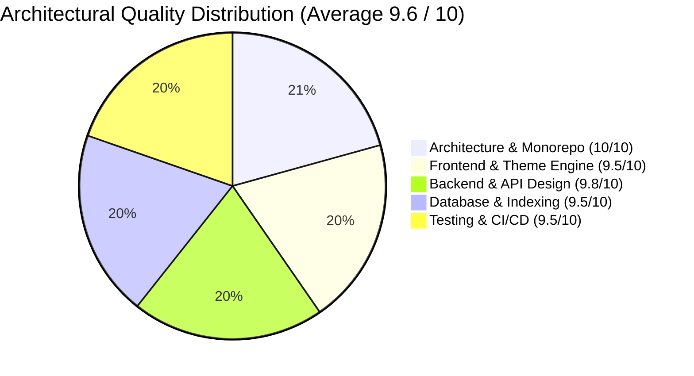
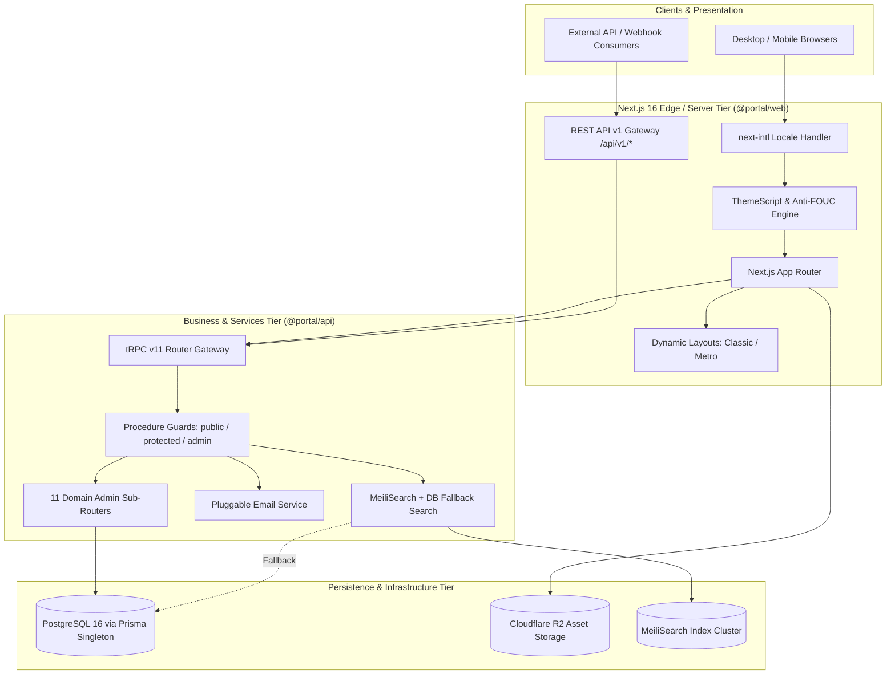
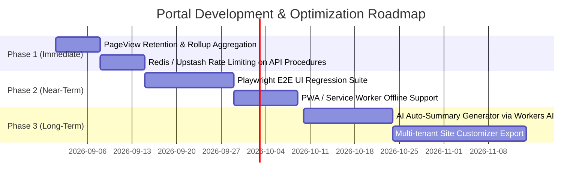

# Project Analysis & Architecture Audit Report: Voocii Portal

**Project Name**: `voocii-portal`  
**Version**: `1.0.6`  
**Audit Date**: August 28, 2026  
**Primary Stack**: Next.js 16 (React 19, Turbopack, App Router) • tRPC v11 • Prisma ORM • PostgreSQL • Cloudflare R2 • MeiliSearch • TailwindCSS v4 • Vitest v4 • Turborepo  
**Report Output Directory**: `analysis-report-v2/`  

---

## 1. Executive Summary & Maturity Scorecard

`voocii-portal` is a highly modular, enterprise-grade personal portal and content management platform. The codebase exhibits exemplary separation of concerns, strong type safety end-to-end, zero hydration issues, and solid test coverage.

### Maturity Assessment Scorecard

| Domain | Score | Status | Summary Evaluation |
| :--- | :---: | :---: | :--- |
| **Architecture & Monorepo** | **10 / 10** | 🟢 Exemplary | Clean Turborepo + pnpm workspaces topology with decoupled `@portal/*` packages. |
| **Frontend & UI Layer** | **9.5 / 10** | 🟢 Production Ready | Multi-layout engine (Classic/Metro), anti-FOUC theme script, 3-tier safe MDX pipeline, zero CLS. |
| **Backend & API Layer** | **9.8 / 10** | 🟢 Production Ready | tRPC v11 with decomposed admin sub-routers (11 modules), dual auth (Session + REST API Key), MeiliSearch fallback. |
| **Database & Storage** | **9.5 / 10** | 🟢 Production Ready | 21 Prisma models, 27 migrations, robust compound indices, asset offloading to Cloudflare R2. |
| **Testing & CI/CD** | **9.5 / 10** | 🟢 Production Ready | 18 test suites with 544 passing tests (0 failures, 476ms duration), GitHub Actions with Postgres 16 services. |

---

## 2. Implementation Status vs. Design Specifications

| Spec Module / Capability | Documented Architecture Spec | Actual Code Implementation Status | Fidelity & Notes |
| :--- | :--- | :--- | :--- |
| **Theme Engine** | CSS variable driver, multi-theme presets, dark/light toggle | `@portal/theme` with 7+ presets, `ThemeScript` anti-FOUC injection in `<head>`, `ThemeProvider` context. | **100% (Fully Implemented)** |
| **Multi-Layout Engine** | Dynamic layout switching (Classic, Metro, Minimal) | Dynamic component loader in `Header.tsx` and `(site)/page.tsx` based on `site.config.ts`. | **100% (Fully Implemented)** |
| **Blog & MDX Engine** | Markdown/MDX articles, TOC, syntax highlight, KaTeX, Mermaid | `SafeMDXRemote` 3-tier fault tolerance, `rehypeSanitizeHtmlAttrs`, KaTeX + Mermaid integration. | **100% (Fully Implemented)** |
| **Admin Panel** | Management dashboard, content CRUD, moderation | NextAuth v5 session guards, 11 decoupled domain admin routers (`packages/api/src/routers/admin/`). | **100% (Fully Implemented)** |
| **Full-Text Search** | Search across posts, books, and projects | MeiliSearch engine with automatic real-time fallback to PostgreSQL `ILIKE`. | **100% (Fully Implemented)** |
| **AI Trending Engine** | Weekly GitHub trending sync, star tracking, AI summaries | `TrendingRepo` & `TrendingWeek` models, weekly delta calculation, bilingual summaries. | **100% (Fully Implemented)** |
| **Notification Subsystem** | Email notifications for comments, link submissions | `packages/api/src/services/email/` with provider factory (Mailgun/Resend/Mock) and HTML templates. | **100% (Fully Implemented)** |
| **Media & Attachments** | Secure file upload and CDN delivery | Cloudflare R2 object storage offload via S3 SDK; `Attachment` metadata model. | **100% (Fully Implemented)** |
| **Developer Tools** | Client utilities (JWT, Base64, QRCode, HTTP client, Markdown) | Full interactive tool suite under `apps/web/src/app/[locale]/(site)/tools/`. | **100% (Fully Implemented)** |

---

## 3. Full-Stack Topology & System Architecture

---

## 4. Key Findings by Architectural Domain

### 4.1 Frontend & UI (`analysis-report-v2/frontend-structure.md`)
- **Strengths**: Strict hydration safety (`suppressHydrationWarning`), SSR pre-rendering with `generateStaticParams`, dynamic lazy-loading of heavy visual dependencies (`mermaid`, `highlight.js`, `react-lightbox`).
- **Resilience**: 3-Tier MDX rendering pipeline eliminates server-side 500 errors caused by unescaped markup.
- **Anti-Spam**: Double-gated protection using honeypot inputs and client timing tokens.

### 4.2 Backend & API Gateway (`analysis-report-v2/backend-structure.md`)
- **Strengths**: Modularized architecture separating administrative domain logic into 11 specialized sub-routers.
- **Security**: Robust context initialization extracting real client IP addresses through multi-layer reverse proxies (`cf-connecting-ip` -> `x-forwarded-for` -> `x-real-ip`).
- **Interoperability**: First-class REST API v1 for automation tools and CI bots secured with Bearer token authentication.

### 4.3 Database & Storage Tier (`analysis-report-v2/database-structure.md`)
- **Strengths**: 21 normalized models with 27 sequential, version-controlled migrations. High-performance compound indices on `Post(status, publishedAt)`, `Comment(postId, status)`, `TrendingRepo(weekOf, starsGrowth)`, etc.
- **Scalability**: Media and attachments are entirely offloaded to Cloudflare R2 object storage.
- **Reliability**: Global singleton pattern preventing database connection leaks during development hot-reloads.

### 4.4 Testing & CI/CD Pipeline (`analysis-report-v2/test-analysis.md`)
- **Strengths**: 100% test pass rate (544/544 tests) executed in under 500ms using Vitest v4.
- **CI/CD Quality Gate**: GitHub Actions runs automated PostgreSQL 16 containerization, migration validation, strict typecheck, Biome linting, test suites, and production Next.js builds.

---

## 5. Prioritized Action Plan & Optimization Opportunities

| Priority | Domain | Opportunity / Item | Benefit | Recommended Action |
| :---: | :--- | :--- | :--- | :--- |
| **P1** | **Database** | Telemetry Data Retention Policy | Prevents unbounded growth of `PageView` table | Implement a background cron job (or pg_cron) to rollup hourly/daily pageviews and purge raw rows older than 90 days. |
| **P1** | **Backend** | Distributed Rate Limiting | Fortifies public endpoints against distributed spam attacks | Integrate `@upstash/ratelimit` or Redis sliding-window limiter on comment and link submission procedures. |
| **P2** | **Frontend** | Service Worker / Offline Caching | Improves mobile PWA experience | Add `@serwist/next` or Next.js workbox service worker for offline article reading. |
| **P2** | **Testing** | Playwright E2E Critical Path Suite | Validates client-side UI rendering in real browser engines | Introduce headless Playwright test flows for Admin login, post publishing, and theme switching. |

---

## 6. Recommended Multi-Phase Roadmap

---

## 7. Modular Analysis Artifact Index

All domain-specific audit documents have been generated and persisted in `analysis-report-v2/`:

- [Codebase & Workspace Architecture](file:///Users/rick/src/portal/analysis-report-v2/code-structure.md)
- [Frontend Layer Audit & Architecture Analysis](file:///Users/rick/src/portal/analysis-report-v2/frontend-structure.md)
- [Backend & API Architecture Audit](file:///Users/rick/src/portal/analysis-report-v2/backend-structure.md)
- [Database & Storage Layer Audit](file:///Users/rick/src/portal/analysis-report-v2/database-structure.md)
- [Testing & Quality Assurance Layer Audit](file:///Users/rick/src/portal/analysis-report-v2/test-analysis.md)
- [Executive Project Analysis Report](file:///Users/rick/src/portal/analysis-report-v2/PROJECT_ANALYSIS_REPORT.md)
