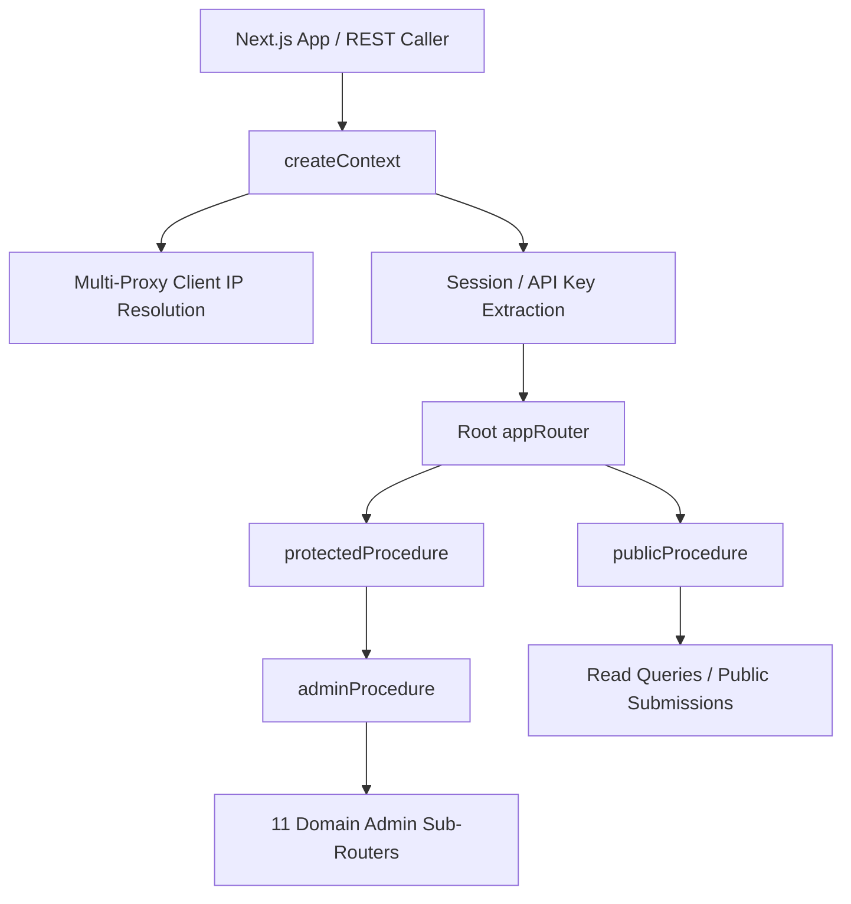
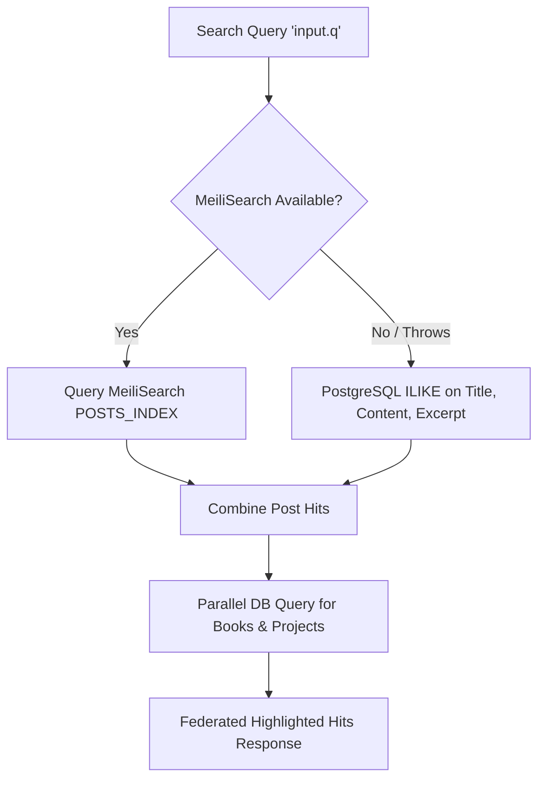

# Backend & API Architecture Audit

## 1. tRPC v11 API Gateway & Context Lifecycle

The backend API layer (`@portal/api`) provides end-to-end type-safe RPC procedures over HTTP via tRPC v11 and SuperJSON serialization.



### Context & Client IP Resolution

`createContext` resolves the authentic client IP across reverse proxies and CDNs:
1. `cf-connecting-ip` (Cloudflare edge)
2. `x-forwarded-for` (standard proxy/load balancer first IP)
3. `x-real-ip` (direct reverse proxy)
4. Fallback: `127.0.0.1`

---

## 2. Procedure Guard Hierarchy & Access Control

Access control is enforced declaratively across three procedure tiers:

| Guard Tier | Security Constraint | Target Usage |
| :--- | :--- | :--- |
| `publicProcedure` | Open access (optional session attached) | Public blog posts, project listings, analytics tracking, comment submissions |
| `protectedProcedure` | Requires `ctx.session.user` | Authenticated profile updates, personal reactions |
| `adminProcedure` | Requires `ctx.session.user.role === 'admin'` | Full CMS management (posts CRUD, config updates, attachment deletions, stats) |

---

## 3. Router Architecture & Domain Decomposition

The API is fully modularized. The administrative endpoints are decoupled from a monolithic router into **11 domain sub-routers** under `packages/api/src/routers/admin/`:

```
packages/api/src/routers/
├── about.ts                  # Public profile & bio queries
├── admin/                    # Decomposed admin sub-routers:
│   ├── book.ts               # Admin book inventory & updates
│   ├── category.ts           # Taxonomy management
│   ├── comment.ts            # Comment moderation & reply approvals
│   ├── config.ts             # Runtime site config mutations
│   ├── guestbook.ts          # Guestbook message moderation
│   ├── link.ts               # Friend links review & approval workflow
│   ├── post.ts               # Article drafts & publishing lifecycle
│   ├── project.ts            # Portfolio project management
│   ├── search.ts             # Search index re-indexing actions
│   ├── stats.ts              # Dashboard analytics aggregation
│   └── trending.ts           # GitHub weekly trending sync & curation
├── analytics.ts              # Page view logging & visitor metrics
├── attachment.ts             # Media metadata management
├── book.ts                   # Public book library & likes
├── category.ts               # Public taxonomy
├── comment.ts                # Public comments & replies
├── gallery.ts                # Photo album retrieval
├── guestbook.ts              # Public guestbook entries
├── link.ts                   # Friend link display & submission
├── portfolio.ts              # Public portfolio projects
├── post.ts                   # Public posts, pagination, RSS
├── profile.ts                # Profile info & credentials
├── reference.ts              # Reference doc links
├── search.ts                 # Full-text search with fallback
└── trending.ts               # GitHub trending public feeds
```

---

## 4. Dual-Channel Authentication & REST API v1

In addition to internal tRPC calls, the system exposes a standard **REST API v1** (`apps/web/src/app/api/v1/`):

1. **Web Sessions**: Cookie-based NextAuth.js v5 JWT/Database sessions for browser interactions.
2. **REST API Key Authentication**: External integrations (CI scripts, mobile apps, CMS headless hooks) authenticate via `Authorization: Bearer <ADMIN_API_KEY>` or `X-API-Key` headers using `authenticateRequest()`.
3. **REST Endpoints**:
   - `GET /api/v1/posts` & `POST /api/v1/posts`
   - `GET /api/v1/posts/[id]` & `PUT /api/v1/posts/[id]` & `DELETE /api/v1/posts/[id]`
   - `GET /api/v1/categories` & `POST /api/v1/categories`
   - `POST /api/v1/upload` (Multipart form uploads to Cloudflare R2 / local storage)

---

## 5. Search Engine & Fault-Tolerant Fallback

The search system (`searchRouter.query`) provides federated search across **Posts**, **Books**, and **Projects**:



- **Zero Downtime Search**: If MeiliSearch is unreachable or unconfigured, search automatically falls back to PostgreSQL `ILIKE` queries without returning errors to the user.
- **Bi-directional Sync**: Mutations in `post.ts` call `indexPost()` and `removePostFromIndex()` to keep MeiliSearch in sync with database changes.

---

## 6. Notification & Email Service

Located in `packages/api/src/services/email/`:
- **Pluggable Architecture**: Implements a provider abstraction supporting Mailgun, Resend, and local/mock logging providers.
- **Event Triggers**: Automated notifications for new comment replies, friend link submissions, and guestbook entries.
- **Template Safety**: Generates responsive, sanitized HTML email templates with escaped user input.
