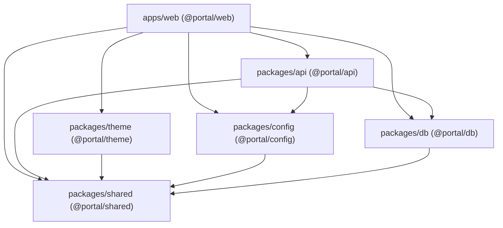
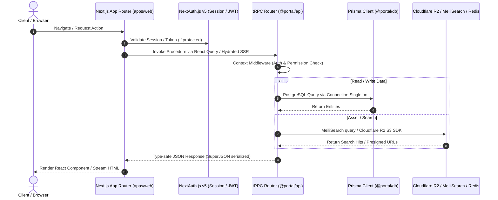

# Codebase & Workspace Architecture

## 1. Monorepo Topology & Build Pipeline

The project is structured as a modern full-stack monorepo managed via **Turborepo** and **pnpm workspaces** (`pnpm@9.15.4`), using Next.js 16 (React 19, Turbopack) on the frontend and tRPC v11 + Prisma ORM on the backend.

### Workspace Hierarchy

```
voocii-portal/ (root)
├── apps/
│   └── web/                     # @portal/web (Next.js 16 App Router, TailwindCSS v4, React 19)
├── packages/
│   ├── api/                     # @portal/api (tRPC v11 routers, procedures, contextual middleware)
│   ├── config/                  # @portal/config (Site configurations, preset definitions, env schemas)
│   ├── db/                      # @portal/db (Prisma client singleton, schema, migration history)
│   ├── shared/                  # @portal/shared (Cross-cutting TypeScript types, validation helpers, utils)
│   └── theme/                   # @portal/theme (Dynamic theme engine tokens, layout variants)
├── tests/                       # Vitest integration & unit test suites
└── documents/                   # Architecture, performance, and API design specifications
```

---

## 2. Package Dependency Graph & Module Breakdown



### Module Responsibilities

| Package | Name | Primary Role & Core Exports | Key Dependencies |
| :--- | :--- | :--- | :--- |
| `apps/web` | `@portal/web` | Next.js 16 presentation layer, SSR/SSG pages, i18n routing, admin panel, REST route handlers | `@trpc/next`, `@auth/prisma-adapter`, `next-intl`, `tailwindcss`, `lucide-react` |
| `packages/api` | `@portal/api` | Business logic, tRPC root routers (`appRouter`), query/mutation procedures, procedure guards (`publicProcedure`, `protectedProcedure`, `adminProcedure`) | `@trpc/server`, `zod`, `superjson` |
| `packages/theme` | `@portal/theme` | CSS variables engine, theme tokens, theme presets (`dark`, `light`, `tokyo-night`, `nord`, `dracula`, etc.), anti-FOUC inline scripts | None |
| `packages/config` | `@portal/config` | Feature flags, dynamic navigation configs, preset configurations, module enablement maps | Zod |
| `packages/db` | `@portal/db` | Prisma ORM client singleton, connection pool management, database schema definitions | `@prisma/client` |
| `packages/shared` | `@portal/shared` | Shared data types, constants, date formatters, slug generators, common validation utils | None |

---

## 3. Build & Task Orchestration (`turbo.json`)

The pipeline defines deterministic build order and topological caching:

```json
{
  "tasks": {
    "build": {
      "dependsOn": ["^build"],
      "outputs": [".next/**", "!.next/cache/**", "dist/**"]
    },
    "dev": { "cache": false, "persistent": true },
    "lint": { "dependsOn": ["^build"] },
    "typecheck": { "dependsOn": ["^build"] },
    "clean": { "cache": false }
  }
}
```

- **Global Env Pass-through**: Injects `DATABASE_URL`, `AUTH_SECRET`, `GITHUB_CLIENT_ID`, `GITHUB_CLIENT_SECRET`, `REDIS_URL`, `MEILISEARCH_URL`, `MEILISEARCH_KEY`, `R2_ACCOUNT_ID`, `ADMIN_API_KEY`, etc.
- **Pre/Post-build Hooks**: `apps/web` utilizes `node ./scripts/clean.mjs` and `clean-sourcemaps.mjs` to strip sensitive artifacts from deployment builds.

---

## 4. End-to-End Data & Execution Flow


