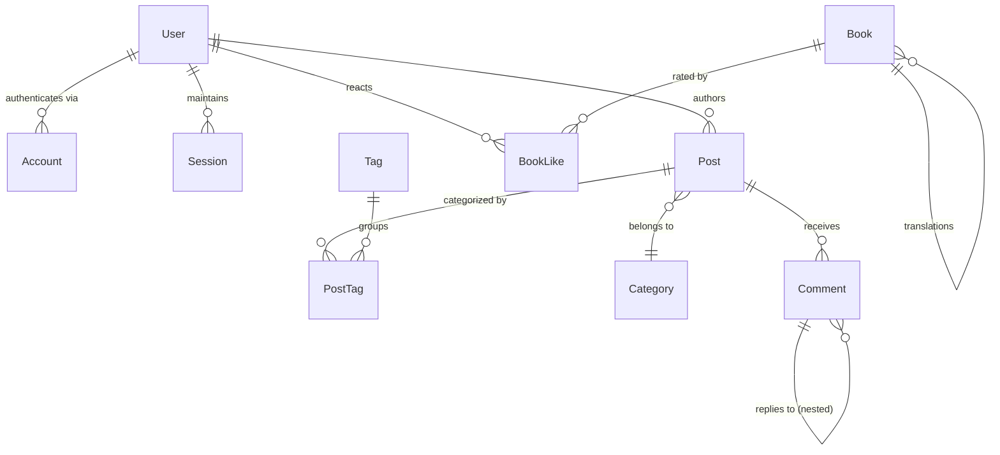

# Database & Storage Layer Audit

## 1. Relational Data Model & Schema Overview

The persistence tier (`packages/db`) uses **PostgreSQL** managed through **Prisma ORM**. The schema defines 21 models partitioned across core functional domains:

### Entity Groups & Responsibilities

| Domain | Models | Core Responsibilities |
| :--- | :--- | :--- |
| **Auth & Security** | `User`, `Account`, `Session` | NextAuth.js v5 compatibility, OAuth linking, role-based permissions (`admin`, `editor`, `viewer`). |
| **Content & Taxonomy** | `Post`, `Category`, `Tag`, `PostTag`, `Comment` | Multi-language blog posts, tag associations, hierarchical comment replies, approval statuses. |
| **Portfolio & Showcase** | `Project`, `Reference`, `Media` | Project showcases, tech stack arrays, download links, reference pages, legacy media items. |
| **Reading & Library** | `Book`, `BookLike` | Book metadata, translation linkages, multi-user like/dislike reactions. |
| **Community & Ecosystem** | `Link`, `GuestbookEntry` | Friend links review lifecycle, submission IP anti-spam tracking, visitor guestbook. |
| **AI Intelligence** | `TrendingRepo`, `TrendingWeek` | GitHub weekly trending repositories, star delta tracking, bilingual AI summaries. |
| **Telemetry & Config** | `PageView`, `SiteConfig`, `AboutInfo`, `Attachment` | Visitor telemetry, runtime dynamic key-value settings, R2 asset metadata. |

---

## 2. Index Optimization & Compound Key Strategy

High-frequency query paths are reinforced with compound and selective indices:

| Model | Index Definition | Optimized Query Pattern |
| :--- | :--- | :--- |
| `Post` | `@@index([status, publishedAt])` | Feed queries filtering published posts sorted by date descending. |
| `Post` | `@@index([views])` | Popular / trending articles query ranking. |
| `Comment` | `@@index([postId, status])` | Fetching approved comments for a specific post. |
| `Link` | `@@index([submitterIp, createdAt])` | Anti-spam rate limiting verification on link submissions. |
| `TrendingRepo` | `@@unique([githubId, weekOf])` | Idempotent weekly syncs preventing duplicate repo snapshots. |
| `TrendingRepo` | `@@index([weekOf])`, `@@index([starsGrowth])` | Weekly leaderboard sorting by star velocity. |
| `BookLike` | `@@unique([bookId, userId])` | Strict idempotency enforcing one reaction per user per book. |

---

## 3. Storage Architecture & Cloudflare R2 Offloading

The system avoids storing large media blobs in PostgreSQL:

- **Attachment Offloading**: Binary assets are stored directly in **Cloudflare R2** via S3-compatible SDK.
- **Metadata Separation**: `Attachment` table records metadata (`id`, `filename`, `mimeType`, `url`, timestamps) with unique constraints on filenames.
- **CDN Distribution**: Assets are served directly via Cloudflare CDN caching with public custom domains (`R2_PUBLIC_URL`).

---

## 4. Connection Pooling & Lifecycle Management

In `packages/db/src/index.ts`:

- **Singleton Pattern**: Prisma Client attaches to `globalThis.prisma` during development to prevent connection exhaustion during Next.js Hot Module Replacement (HMR).
- **Environment-Aware Logging**: Verbose query logs enabled only during `NODE_ENV === 'development'`.

---

## 5. Migration Discipline & Telemetry Lifecycle

- **27 Sequential Migrations**: Schema alterations are rigorously tracked in `prisma/migrations/` as version-controlled SQL files.
- **Telemetry Retention Optimization**: The `PageView` table indexes `path` and `createdAt`. Recommendations for high-volume scale include scheduled rollup aggregation into weekly/monthly metrics and archiving records older than 90 days.
