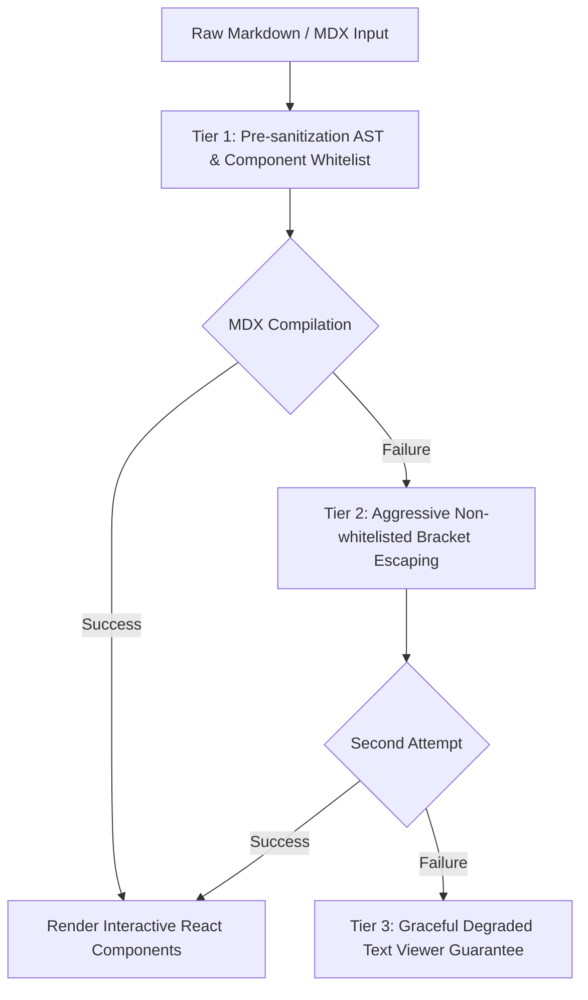

# Frontend Layer Audit & Architecture Analysis

## 1. Routing & Layout Architecture

The frontend application (`@portal/web`) leverages **Next.js 16 App Router** with nested route grouping and dynamic internationalization (`next-intl`).

### Route Hierarchy

```
apps/web/src/app/
├── [locale]/
│   ├── layout.tsx                    # Root locale layout with fonts, theme script, i18n & tRPC providers
│   ├── (site)/                       # Public-facing presentation group
│   │   ├── layout.tsx                # Dynamic Header/Footer wrapper + PageViewTracker
│   │   ├── page.tsx                  # Home page (Classic / Metro variants)
│   │   ├── blog/                     # Blog index & [slug] article reader (MDX / TOC)
│   │   ├── tools/                    # Client-side utility suite (JWT, Base64, QRCode, HTTP client, MD editor)
│   │   ├── trending/                 # GitHub weekly trending dashboard
│   │   ├── links/                    # Friend links & submission modal
│   │   ├── books/                    # Reading list & reactions
│   │   ├── about/ / profile/         # Profile & resume views
│   │   └── gallery/ / guestbook/     # Photo album & guestbook
│   ├── (admin)/                      # Backoffice administration group
│   │   ├── layout.tsx                # Admin sidebar, breadcrumbs, auth guard wrapper
│   │   └── admin/                    # Management pages (posts, categories, links, analytics, attachments, etc.)
│   └── auth/
│       └── signin/page.tsx           # Authentication entry (OAuth + Credentials)
└── api/                              # Route handlers (REST endpoints, tRPC gateway, auth callbacks)
```

---

## 2. Multi-Layout Engine & Layout Switching

The application implements a decoupled layout engine configured via `site.config.ts`:

- **Layout Variants**: Supports `classic` (editorial blog layout) and `metro` (modern tile/dashboard layout).
- **Dynamic Header Loading**: `Header.tsx` uses `next/dynamic` to lazy-load the appropriate header component (`ClassicHeader` or `MetroHeader`), preventing unused layout code from leaking into the client bundle.
- **Config-Driven Navigation**: Nav items are generated dynamically by querying `@portal/config`'s `getNavItems(siteConfig)` and filtering disabled modules.

---

## 3. Theme Engine & Anti-FOUC Architecture

The theming subsystem (`@portal/theme`) delivers zero-flash theme rendering:

1. **CSS Variable Design Tokens**:
   - Palette definitions (`zenith`, `nord`, `tokyo-night`, `dracula`, `solarized`, `light`, `dark`) inject uniform CSS variables:
     `--portal-color-bg`, `--portal-color-surface`, `--portal-color-primary`, `--portal-color-text`, `--portal-color-border`, etc.
2. **Anti-FOUC Inline Script (`ThemeScript`)**:
   - Injected in `<head>` before body hydration:
     ```html
     <ThemeScript defaultTheme={siteConfig.theme.default || 'zenith'} />
     ```
   - Reads `localStorage.getItem('portal-theme')` synchronously and sets `data-theme` attribute on `document.documentElement`, completely eliminating flash of unstyled content (FOUC).
3. **Hydration Warning Suppression**:
   - `suppressHydrationWarning` is appropriately set on `<html lang={locale}>` to avoid React 19 hydration mismatches caused by pre-rendered theme classes.

---

## 4. Safe MDX & Content Rendering Pipeline

Blog articles and dynamic content are processed through a fault-tolerant **3-Tier Sanitized MDX Pipeline** (`SafeMDXRemote`):



- **XSS Protection**: Sanitization filters script tags and unauthorized HTML attributes via `rehypeSanitizeHtmlAttrs`.
- **Zero 500-Error Guarantee**: Any syntax error or malformed JSX in blog content automatically drops down to Tier 2/3 without throwing an unhandled server exception.
- **Interactive Enhancements**: Embeds lazy-loaded `MermaidRenderer`, `MathRenderer` (KaTeX/remark-math), and syntax highlighted `CodeBlock` components.

---

## 5. Form Interactions & Anti-Spam Defenses

Visitor interactions (e.g. submitting friend links, posting comments) are fortified against automated bots:

- **Honeypot Traps**: Invisible input fields that cause instant request rejection if filled by automated scrapers.
- **Timestamp & Timing Tokens**: Prevents rapid replay attacks by validating human completion time intervals.
- **Client-Side Zod Validation**: Instant input feedback matching backend schema contracts before dispatching tRPC mutations.

---

## 6. Core Web Vitals & Performance Optimizations

| Optimization Strategy | Implementation Details | Impact |
| :--- | :--- | :--- |
| **Font Optimization** | Google Fonts (`Sora`, `IBM Plex Mono`) loaded with `display: 'swap'` and CSS variables | Zero layout shift (CLS: 0.00) & instant text visibility |
| **Dynamic Heavy Bundles** | `mermaid`, `highlight.js`, `yet-another-react-lightbox` isolated via dynamic imports | Drastically reduced initial JS bundle size |
| **Static Pre-rendering (SSG)** | `generateStaticParams` configured for `[locale]` routes | Sub-50ms TTFB for cached public routes |
| **Image Pipeline** | `next/image` with explicit `priority` flags on hero banners | Optimized LCP with responsive srcset |
