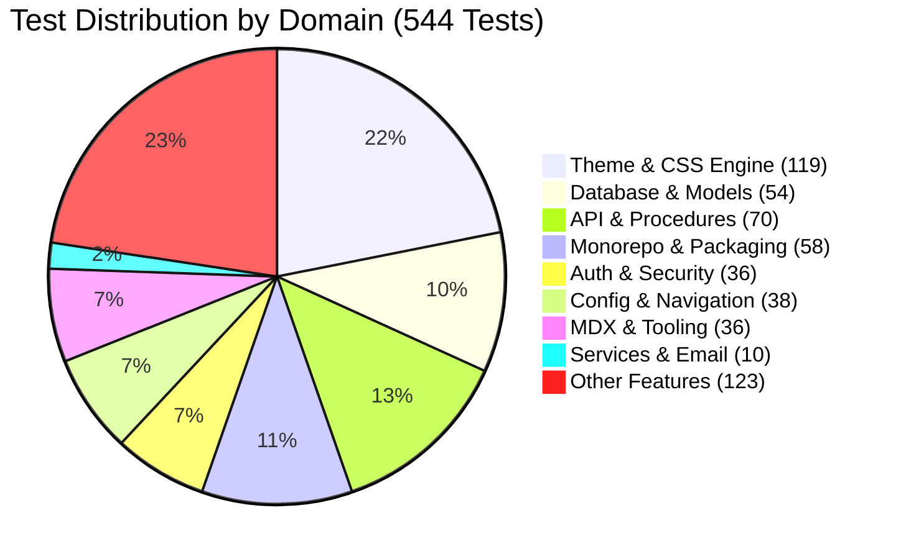

# Testing & Quality Assurance Layer Audit

## 1. Test Suite Health & Execution Overview

The project uses **Vitest v4** as its test runner across monorepo packages and full-stack integration boundaries.

### Test Execution Metrics

- **Total Test Suites**: 18 files passed (100%)
- **Total Test Cases**: 544 tests passed (0 failing, 0 skipped)
- **Execution Duration**: ~476 ms
- **Assertion Drift**: 0 detected (test assertions are fully synchronized with the current modular architecture)

```
Test Files  18 passed (18)
     Tests  544 passed (544)
  Duration  476ms (transform 580ms, setup 0ms, import 939ms, tests 360ms, environment 2ms)
```

---

## 2. Test Pyramid & Domain Coverage Breakdown



### Test Suite Directory & Responsibilities

| Test File | Passed Tests | Domain / Targeted Layer | Key Validations |
| :--- | :--- | :--- | :--- |
| `tests/theme-engine.test.ts` | 67 | `@portal/theme` | CSS variable extraction, theme palette switching, anti-FOUC script generation, color contrast. |
| `tests/monorepo.test.ts` | 58 | Monorepo Topology | Package export paths, internal workspace resolutions, dependency boundary compliance. |
| `tests/db.test.ts` | 54 | `@portal/db` | Schema relations, unique constraints, cascade rules, Prisma singleton instantiation. |
| `tests/theme.test.ts` | 52 | `@portal/theme` | Preset themes, token keys consistency across dark/light modes. |
| `tests/phase4.test.ts` | 43 | End-to-End Features | Integration of posts, comments, likes, and analytics flow. |
| `tests/modules.test.ts` | 40 | `@portal/config` | Module registry, dynamic module enablement/disablement toggles. |
| `tests/search-admin.test.ts` | 37 | `@portal/api` | Modular admin sub-routers (`adminPostRouter`, `adminCommentRouter`, `adminTrendingRouter`, etc.) & search fallback. |
| `tests/auth.test.ts` | 36 | Security & Auth | NextAuth v5 session resolution, role-based procedure guards (`adminProcedure`, `protectedProcedure`). |
| `tests/api.test.ts` | 33 | `@portal/api` | tRPC procedures, input schemas, SuperJSON serialization. |
| `tests/layout.test.ts` | 32 | `@portal/web` | Layout engine switches (`ClassicLayout`, `MetroLayout`), navigation bar generation. |
| `tests/config-schema.test.ts` | 29 | `@portal/config` | Zod schema validation for site config, presets, and environment variables. |
| `tests/analytics-cleanup.test.ts` | 12 | Telemetry | PageView aggregation algorithms, retention cleanup filters. |
| `tests/email-service.test.ts` | 10 | `@portal/api` | Email provider factory (Mailgun / Resend / Mock), event notifications, disabled state bypass. |
| `tests/shared.test.ts` | 10 | `@portal/shared` | Slug generators, string sanitizers, date utilities. |
| `tests/config.test.ts` | 9 | `@portal/config` | Configuration parsing and default fallback structures. |
| `tests/mdx-sanitizer.test.ts` | 9 | Content Security | 3-tier MDX sanitizer, XSS script injection filtering, unclosed tag tolerance. |
| `tests/rest-api.test.ts` | 7 | REST API v1 | Bearer token authentication, pagination params, status filtering. |
| `tests/tools-http-client.test.ts` | 6 | Web Tools | HTTP request proxy client, header sanitization. |

---

## 3. CI/CD Pipeline & Quality Gates (`.github/workflows/ci.yml`)

The automated continuous integration pipeline executes on every push and pull request to `main`:

```mermaid
graph LR
    Checkout[Checkout Code] --> PG[Start PostgreSQL 16 Service]
    PG --> Install[pnpm install --frozen-lockfile]
    Install --> Migrate[pnpm db:push]
    Migrate --> Typecheck[pnpm typecheck]
    Typecheck --> Lint[pnpm lint]
    Lint --> Test[pnpm test (Vitest)]
    Test --> Build[pnpm build (Turborepo)]
```

### Pipeline Safety Controls
- **Ephemeral DB Container**: Spawns isolated PostgreSQL 16 container with active health checking (`pg_isready`).
- **Frozen Lockfile**: Guarantees deterministic dependency installation (`pnpm install --frozen-lockfile`).
- **Multi-stage Verification**: Fails immediately on TypeScript compilation errors, Biome lint warnings, unit/integration test regressions, or Next.js build errors.
