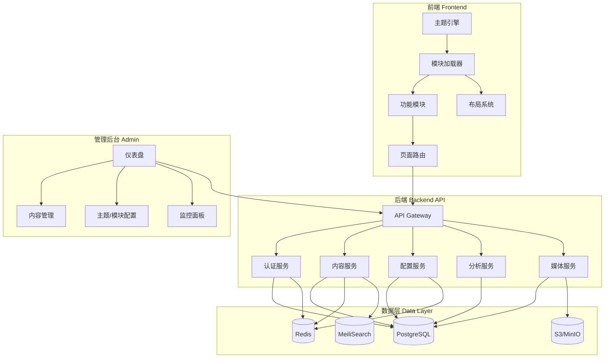
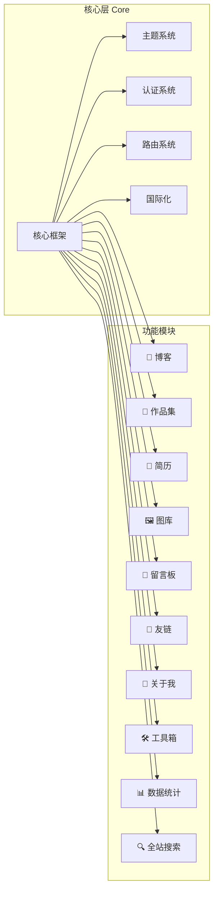

# Portal — 个人网站架构设计文档

## 1. 项目概述

构建一个**模块化、主题可切换、功能可配置**的个人网站平台，附带管理后台。核心设计原则：

- **模块化**：所有功能以独立模块存在，可按需启用/禁用
- **主题化**：支持运行时切换主题，主题系统与功能模块解耦
- **可配置**：通过配置文件定义网站的功能组合（预设套餐）
- **可管理**：管理后台提供监控、内容管理、配置管理能力

---

## 2. 系统架构

### 2.1 整体架构图



### 2.2 模块化架构



---

## 3. 功能模块设计

### 3.1 核心模块（始终启用）

| 模块 | 职责 |
|------|------|
| **主题引擎** | CSS 变量驱动的主题切换，支持明暗模式及自定义主题 |
| **路由系统** | 动态路由，模块启用时自动注册 |
| **认证系统** | 管理员登录、JWT Token 管理 |
| **国际化** | 多语言支持（中/英文为基础） |
| **SEO 引擎** | 自动生成 sitemap、meta、Open Graph |
| **布局系统** | 响应式布局，Header/Footer/Sidebar 可配置 |

### 3.2 可选功能模块

| 模块 | 功能描述 | 核心能力 |
|------|----------|----------|
| 📝 **博客** | Markdown 博客系统 | 文章 CRUD、分类/标签、代码高亮、评论 |
| 🎨 **作品集** | 项目展示 | 项目卡片、筛选排序、技术栈标签 |
| 📄 **简历** | 在线简历 | 时间线布局、技能图表、PDF 导出 |
| 🖼️ **图库** | 图片展示 | 瀑布流、灯箱预览、相册分组 |
| 💬 **留言板** | 访客互动 | 留言、回复、表情、反垃圾 |
| 🔗 **友链** | 友情链接管理 | 链接卡片、存活检测 |
| 👤 **关于我** | 个人介绍 | 富文本编辑、社交链接 |
| 🛠️ **工具箱** | 实用工具集合 | 可插拔注册、独立运行 |
| 📊 **数据统计** | 访问分析 | PV/UV、地域、设备分析 |
| 🔍 **全站搜索** | 内容搜索 | 全文索引、即时搜索 |

### 3.3 模块接口规范

```typescript
interface SiteModule {
  id: string;                    // 唯一 ID
  name: string;                  // 显示名称
  icon: string;
  version: string;
  routes: RouteConfig[];         // 路由定义
  navItems?: NavItem[];          // 导航菜单项
  adminRoutes?: RouteConfig[];   // 管理后台路由
  widgets?: WidgetConfig[];      // 仪表盘小组件
  onInit?: () => Promise<void>;
  onDestroy?: () => void;
  dependencies?: string[];       // 依赖的其他模块
}
```

---

## 4. 主题系统设计

### 4.1 主题定义

```typescript
interface ThemeConfig {
  id: string;
  name: string;
  mode: 'light' | 'dark';
  colors: {
    primary: string; secondary: string; accent: string;
    background: string; surface: string;
    text: string; textSecondary: string; border: string;
  };
  typography: {
    fontFamily: string; headingFont: string; monoFont: string;
    scale: number;
  };
  spacing: { unit: number; radius: string; };
  effects: { shadow: string; blur: string; transition: string; };
}
```

### 4.2 预设主题

| 主题 | 风格 |
|------|------|
| **极简白** | 大量留白、衬线体、低饱和度 |
| **暗夜黑** | 深色背景、霓虹强调色、科技感 |
| **赛博朋克** | 高对比度、故障艺术、闪烁动效 |
| **自然绿** | 暖色调、有机形状、手绘质感 |
| **复古棕** | 报纸排版、旧纸张纹理、Serif |

---

## 5. 功能预设组合

| 组合 | 启用模块 | 推荐主题 | 适用场景 |
|------|----------|----------|----------|
| 🎯 **极简主页** | About + Resume + Links | 极简白/暗夜黑 | 个人名片、求职 |
| ✍️ **技术博客** | Blog + About + Search + Analytics + Links | 极简白/复古棕 | 技术写作、知识分享 |
| 🎨 **创意作品集** | Portfolio + Gallery + About + Guestbook | 暗夜黑/赛博朋克 | 设计师、摄影师 |
| 🚀 **全功能站点** | 全部模块 | 任意 | 全方位个人平台 |
| 🛠️ **开发者工具站** | Tools + Blog + Search + Analytics | 暗夜黑/赛博朋克 | 工具分享、技术资源 |

---

## 6. 管理后台设计

| 页面 | 功能 |
|------|------|
| **仪表盘** | 实时 PV/UV、系统资源、最新评论/留言、快捷入口 |
| **内容管理** | Markdown 编辑器、草稿/发布、批量操作、媒体上传 |
| **外观配置** | 主题预览切换、布局配置、导航编辑、自定义 CSS |
| **模块管理** | 模块启用/禁用、一键切换预设组合、模块参数配置 |
| **数据分析** | 访问趋势、地域热力图、设备/浏览器分布 |
| **系统设置** | 站点信息、SEO 配置、备份/恢复、API Key 管理 |

---

## 7. 技术栈选择

### 7.1 前端框架对比

| 方案 | 优势 | 劣势 |
|------|------|------|
| **Next.js 15** | SSR/SSG/ISR 全支持、React 生态丰富、Vercel 极简部署 | 体量较大 |
| **Nuxt 3** | Vue 生态、自动导入、中文社区强 | 第三方库较少 |
| **Astro** | 零 JS 默认、极致性能 | 复杂交互需额外框架 |
| **SvelteKit** | 编译优化、包体极小 | 生态较小 |

### 7.2 后端方案对比（Node.js）

| 方案 | 优势 | 劣势 |
|------|------|------|
| **Next.js API + tRPC** | 前后端统一、全栈类型安全 | 与 Next.js 绑定 |
| **NestJS** | 企业级架构、模块系统完善 | 体量大 |
| **Hono** | 超轻量、多运行时兼容 | 生态较新 |

### 7.3 后端方案对比（Python）

| 方案 | 优势 | 劣势 |
|------|------|------|
| **FastAPI** | 自动 OpenAPI 文档、async 原生、Pydantic 校验强大、性能优秀 | 与前端类型不互通、生态偏数据/AI |
| **Django + DRF** | 自带 Admin 后台、ORM 成熟、安全完善 | 同步为主、灵活性稍弱 |
| **Flask / Quart** | 极轻量、自由组装 | 大项目缺少约定 |
| **Litestar** | 现代异步、依赖注入优秀 | 社区较小 |

### 7.4 Python 后端整体优劣分析

**✅ 优势：**

| 方面 | 说明 |
|------|------|
| **Django Admin** | 自带成熟管理后台，大幅降低后台开发量 |
| **AI/数据集成** | Python 是 AI/ML 首选语言，集成 AI 功能零摩擦 |
| **内容处理库丰富** | Pillow (图片)、python-markdown、feedgen (RSS)、WeasyPrint (PDF) |
| **部署灵活** | 传统 VPS、Docker、Serverless 均支持 |
| **中文社区** | Django/FastAPI 中文资源极丰富 |

**❌ 劣势：**

| 方面 | 说明 |
|------|------|
| **前后端类型割裂** | TS 前端 ↔ Python 后端无法共享类型，需 OpenAPI codegen |
| **全栈 DX** | 无法实现 tRPC 式端到端类型安全 |
| **SSR 局限** | Python 不能做 React SSR，前端必须独立部署 |
| **冷启动** | Python 冷启动比 Node.js 慢，Serverless 不友好 |
| **运行时性能** | 吞吐量低于 Node.js/Go |

### 7.5 部署方案对比

| 方案 | 适用技术栈 | 优势 | 劣势 |
|------|------------|------|------|
| **Vercel** | Next.js 全栈 | 一键部署、CDN、Preview URL | 用量限制、锁定 |
| **Vercel + Railway/Fly.io** | Next.js + Python 后端 | 各取所长 | 两套流水线 |
| **Cloudflare** | Node.js 全栈 | 边缘计算、免费额度高 | 不支持 Python |
| **Docker + VPS** | 任意（Python 推荐） | 完全控制、统一编排 | 需自行运维 |

> **注意**：选择 Python 后端时，最推荐 **Docker Compose + VPS**，可统一编排前端、后端、PostgreSQL、Redis、MeiliSearch。

---

### 7.6 推荐技术栈

#### 方案 A（⭐ 推荐）：全栈 TypeScript

| 层级 | 技术 | 理由 |
|------|------|------|
| 前端 | **Next.js 15** | SSR/SSG/ISR、React 生态最丰富 |
| 样式 | **Tailwind CSS v4** | CSS 变量原生支持、主题切换自然 |
| 状态 | **Zustand** | 轻量、TypeScript 友好 |
| API | **tRPC** | 全栈类型安全、零样板代码 |
| ORM | **Prisma** | Schema 即文档、类型自动生成 |
| 数据库 | **PostgreSQL** | 全文搜索、JSON 支持 |
| 认证 | **Auth.js v5** | 与 Next.js 深度集成 |
| 部署 | **Vercel** + Docker | 一键部署 + 自托管 |

#### 方案 B：Python 后端 + Next.js 前端

| 层级 | 技术 | 理由 |
|------|------|------|
| 前端 | **Next.js 15** | 前端体验不妥协 |
| 后端 | **FastAPI** | 自动文档、async 性能优秀 |
| ORM | **SQLAlchemy 2.0 + Alembic** | Python 最成熟 ORM |
| 数据库 | **PostgreSQL** | 同方案 A |
| API 对接 | **OpenAPI Generator** | 自动生成 TS 客户端 |
| 任务队列 | **Celery + Redis** | 后台任务处理 |
| 部署 | **Docker Compose + VPS** | Nginx + Uvicorn + Next.js |

#### 方案决策矩阵

| 因素 | 方案 A (全栈 TS) | 方案 B (Python) |
|------|-----------------|-----------------|
| 开发速度 | ⭐⭐⭐⭐⭐ | ⭐⭐⭐ |
| 类型安全 | ⭐⭐⭐⭐⭐ | ⭐⭐⭐ |
| AI/ML 集成 | ⭐⭐ | ⭐⭐⭐⭐⭐ |
| 部署简单度 | ⭐⭐⭐⭐⭐ | ⭐⭐⭐ |
| 团队 Python 强 | — | ⭐⭐⭐⭐⭐ |

---

## 8. 项目目录结构

### 方案 A（全栈 TS）

```
portal/
├── apps/web/                    # Next.js 应用
│   ├── app/(site)/              # 公开页面
│   ├── app/(admin)/             # 管理后台
│   ├── app/api/                 # API 路由
│   └── components/
├── packages/
│   ├── modules/                 # 功能模块
│   ├── theme/                   # 主题系统
│   ├── config/                  # 配置系统
│   ├── db/                      # Prisma 数据库
│   ├── api/                     # tRPC API
│   └── shared/                  # 共享工具
├── pnpm-workspace.yaml
├── turbo.json
└── docker-compose.yml
```

### 方案 B（Python 后端）

```
portal/
├── frontend/                    # Next.js 前端
│   ├── app/(site)/
│   ├── app/(admin)/
│   └── lib/api-client/          # OpenAPI 生成的客户端
├── backend/                     # Python 后端
│   ├── app/main.py              # FastAPI 入口
│   ├── app/modules/             # 功能模块 API
│   ├── app/models/              # SQLAlchemy models
│   └── app/migrations/          # Alembic 迁移
├── nginx/nginx.conf
├── docker-compose.yml
└── .env
```

---

## 9. 配置系统

```typescript
// site.config.ts
export default defineConfig({
  site: { title: "Rick's Portal", url: 'https://rick.dev', locale: 'zh-CN' },
  preset: 'tech-blog',  // 'minimal' | 'tech-blog' | 'creative' | 'full' | 'devtools'
  modules: {
    blog: { enabled: true, postsPerPage: 10 },
    portfolio: { enabled: false },
    search: { enabled: true, engine: 'meilisearch' },
  },
  theme: {
    default: 'minimal-light',
    available: ['minimal-light', 'dark-neon', 'cyberpunk', 'nature', 'retro'],
    allowUserSwitch: true,
  },
  admin: { enabled: true, basePath: '/admin' },
});
```

---

## 10. 数据模型

```mermaid
erDiagram
    User ||--o{ Post : writes
    Category ||--o{ Post : contains
    Post ||--o{ Comment : has
    Comment ||--o{ Comment : replies

    User { string id PK; string email; string name; string role }
    Post { string id PK; string title; string slug; string content; string status; string[] tags }
    Category { string id PK; string name; string slug }
    Project { string id PK; string title; string description; string[] techStack }
    Media { string id PK; string url; string type; int size }
    Comment { string id PK; string content; string authorName; string postId FK }
    GuestbookEntry { string id PK; string content; string authorName }
    Link { string id PK; string name; string url; boolean isAlive }
    PageView { string id PK; string path; string referrer; string country }
    SiteConfig { string id PK; string key; json value }
```

---

## 11. 安全设计

| 方面 | 方案 A (TS) | 方案 B (Python) |
|------|------------|-----------------|
| 认证 | Auth.js v5, JWT + HttpOnly Cookie | FastAPI + python-jose JWT |
| 授权 | RBAC (admin/editor/viewer) | 同左 |
| 输入校验 | Zod | Pydantic v2 |
| XSS | React 转义 + CSP + DOMPurify | 同左 |
| 速率限制 | Upstash Ratelimit | slowapi / Redis |
| SQL 注入 | Prisma 参数化 | SQLAlchemy 参数化 |

---

## 12. 性能优化

| 策略 | 实现 |
|------|------|
| SSG | 博客、简历等内容页静态生成 |
| ISR | 频繁更新页增量再生 |
| 图片优化 | Next.js Image 自动 WebP/AVIF |
| 代码分割 | 按模块/路由分割，禁用模块不打包 |
| 边缘缓存 | Vercel Edge / Nginx + CDN |
| 懒加载 | 图库、评论区延迟加载 |

---

## 13. 后续扩展

- AI 摘要生成、智能推荐
- Newsletter 邮件订阅
- Monaco 在线代码演示
- PWA 离线访问
- Giscus 评论系统
- 多作者协作
