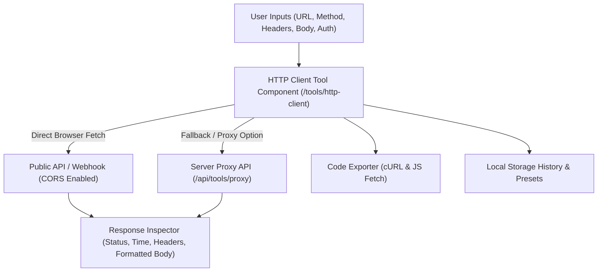

# [Design] HTTP Request Sender Tool (API Client)

Add a clean, developer-focused HTTP Request Sender tool under **Developer Tools** (`/tools/http-client`) designed for API testing, Webhook triggering (e.g., IndexNow, Slack, Discord), and header/body inspection without heavy Postman bloat.

## User Review Required

> [!IMPORTANT]
> **Scope & Capabilities**:
> - **Supported HTTP Methods**: `GET`, `POST`, `PUT`, `PATCH`, `DELETE`, `HEAD`, `OPTIONS`.
> - **CORS Handling**: Runs in the browser via standard `fetch()`. Includes a clear CORS diagnostic indicator if an API endpoint blocks cross-origin requests, plus an optional Server Proxy route (`/api/tools/proxy`) for testing strict non-CORS APIs.
> - **Built-in Presets**: Pre-configured templates including **IndexNow Webhook Submit** (`https://api.indexnow.org/indexnow`), **HTTPBin Test**, and **JSONPlaceholder**.
> - **Code Snippet Generator**: 1-click export of configured requests to `cURL` or `fetch()` JS code.

---

## Technical Architecture & Design

---

## Key Features & User Interface

### 1. Request Builder Header
- **HTTP Method Dropdown**: Color-coded badges for `GET` (Green), `POST` (Blue), `PUT` (Orange), `PATCH` (Yellow), `DELETE` (Red), `HEAD` (Purple), `OPTIONS` (Gray).
- **URL Input**: Auto-syncs with Query Parameters tab when `?key=value` is typed.
- **Send Button**: Includes keyboard shortcut (`Cmd + Enter` / `Ctrl + Enter`).

### 2. Request Configuration Panel (Tabs)
- **Params (Query Strings)**: Dynamic Key-Value table with active checkboxes and automatic URL encoding.
- **Headers**: Custom header key-value pairs with quick presets (`Content-Type: application/json`, `Accept: application/json`, `Authorization`).
- **Body** (Active for POST / PUT / PATCH):
  - `JSON`: Raw JSON editor with auto-format button and live syntax error indicator.
  - `x-www-form-urlencoded`: Key-value form data pairs.
  - `Raw Text`: Plain text, HTML, or XML payload.
  - `None`: No payload body.
- **Auth**:
  - `Bearer Token`: Auto-sets `Authorization: Bearer <token>`.
  - `Basic Auth`: Accepts Username + Password and auto-encodes to `Authorization: Basic <base64>`.
  - `API Key`: Injects as custom Header or Query Parameter.

### 3. Response Inspector Panel
- **Status Bar**:
  - Status Code Badge: `200 OK` (Emerald), `201 Created` (Emerald), `400 Bad Request` (Amber), `404 Not Found` (Amber), `500 Internal Error` (Rose).
  - Response Time (`ms`) & Body Size (`KB`).
- **Response Tabs**:
  - **Body**: Formatted JSON/XML tree viewer with syntax highlighting and Copy button.
  - **Headers**: Key-value table of server response headers.
  - **cURL / Code**: Generated `cURL` command and `JavaScript fetch()` snippet ready to copy.

### 4. Built-in Preset Templates
Quick-fill buttons for common developer tasks:
1. **IndexNow URL Submission**:
   - Method: `POST`
   - URL: `https://api.indexnow.org/indexnow`
   - Body: Pre-filled JSON structure for `voocii.com` IndexNow submission.
2. **JSONPlaceholder GET**:
   - Method: `GET`
   - URL: `https://jsonplaceholder.typicode.com/posts/1`
3. **HTTPBin Echo POST**:
   - Method: `POST`
   - URL: `https://httpbin.org/post`

---

## Proposed Changes

### Web Application (`apps/web`)

#### [NEW] [HttpClientPage.tsx](file:///Users/rick/src/portal/apps/web/src/app/[locale]/(site)/tools/http-client/page.tsx)
- Main tool page component implementing the HTTP Request Client UI, tabs, fetch execution, response parsing, and cURL export.

#### [NEW] [proxy/route.ts](file:///Users/rick/src/portal/apps/web/src/app/api/tools/proxy/route.ts)
- Lightweight optional API proxy route to bypass CORS restrictions when testing non-CORS enabled APIs in dev/testing environments.

#### [MODIFY] [page.tsx](file:///Users/rick/src/portal/apps/web/src/app/[locale]/(site)/tools/page.tsx)
- Register `http-client` in the Developer Tools catalog grid with icon (`Send` / `Globe`) and description.

#### [MODIFY] [zh.json](file:///Users/rick/src/portal/apps/web/messages/zh.json) & [en.json](file:///Users/rick/src/portal/apps/web/messages/en.json)
- Add translation keys for `Tools.httpClient` and `ToolsHttpClient` UI strings (Methods, Headers, Body, Auth, Response, Presets).

---

## Verification Plan

### Automated Tests
- Unit tests in `tests/tools-http-client.test.ts` for:
  - Query parameter parsing and stringifying.
  - Basic Auth Base64 encoding.
  - cURL command generator logic.
  - JSON formatting & validation.

### Manual Verification
- Test `GET` request against `https://jsonplaceholder.typicode.com/posts/1`.
- Test `POST` request with JSON body against IndexNow endpoint `https://api.indexnow.org/indexnow`.
- Test cURL copy export and verify syntax in terminal.
- Verify responsive layout on desktop and mobile viewports.
